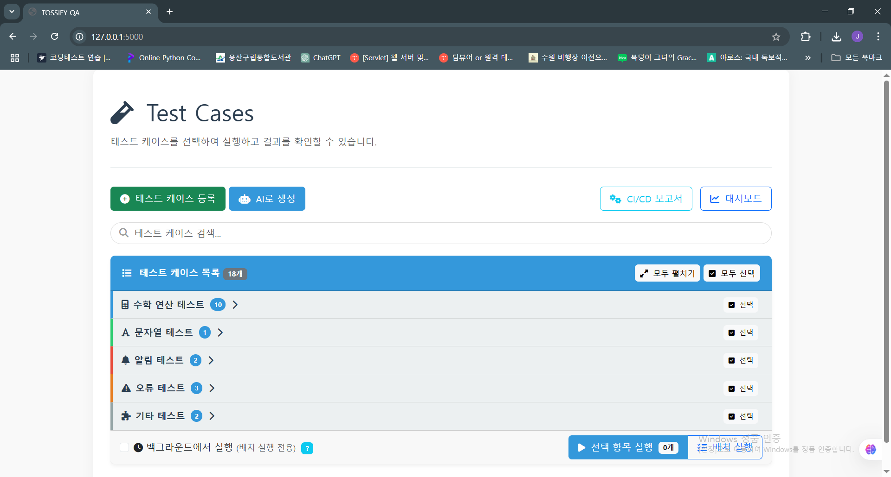
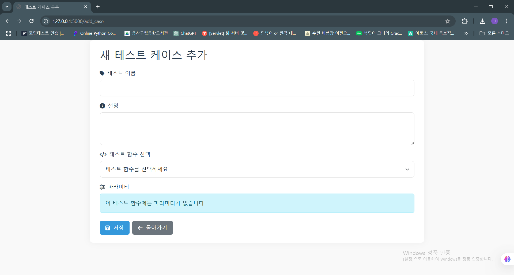
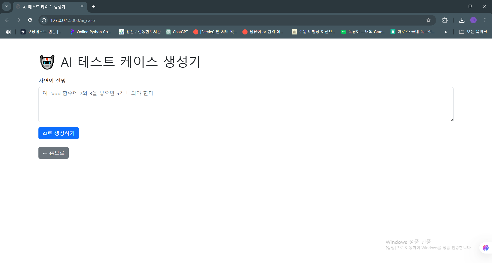
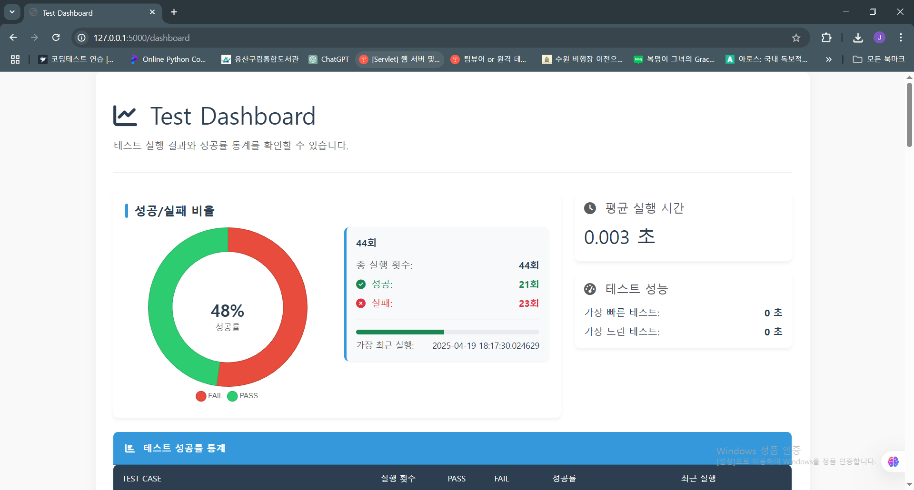
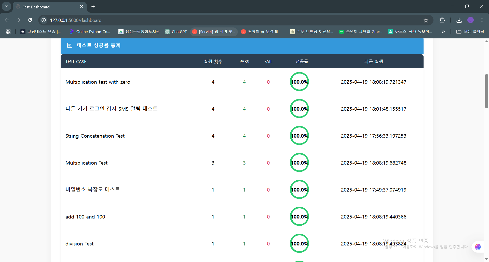
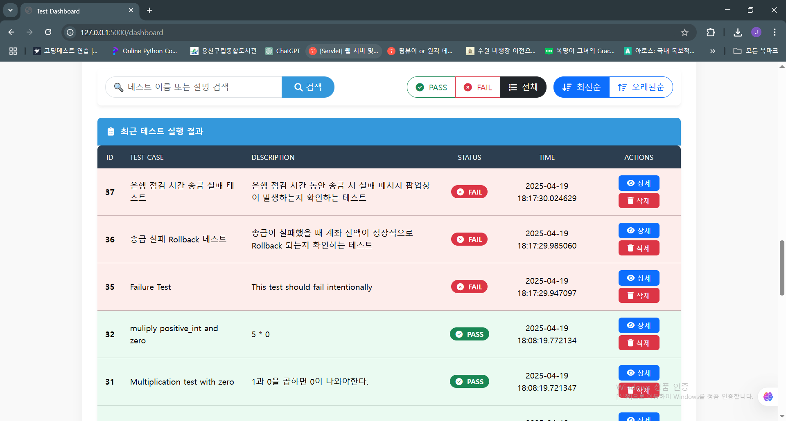
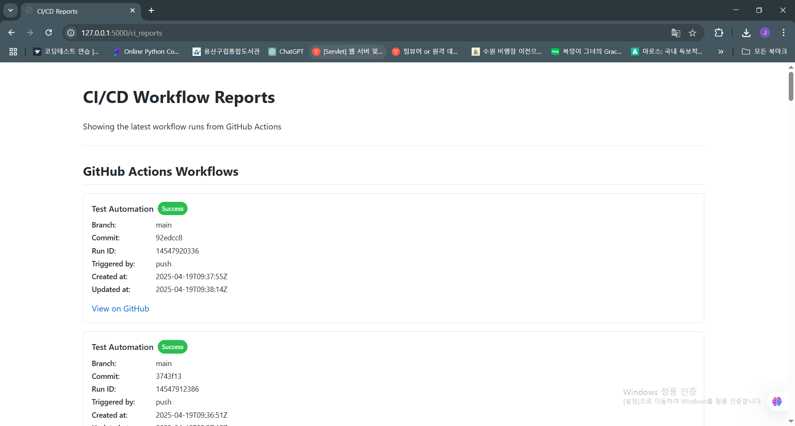

# 📊 SnapTest: QA 테스트 자동화 플랫폼

SnapTest는 테스트 케이스를 생성, 관리, 실행하고 결과를 실시간으로 시각화할 수 있는 종합적인 QA 테스트 자동화 플랫폼입니다. 사용자 친화적인 웹 인터페이스와 강력한 백엔드 시스템을 통해 테스트 자동화 프로세스를 간소화하고, 실시간 피드백을 제공합니다.


## 🖼️ 스크린샷

### 메인 화면 - 테스트 케이스 관리


### 테스트 케이스 생성
 

### 대시보드 및 시각화
 



### CI/CD 통합


## 🚀 주요 기능

### 📋 테스트 케이스 관리

* **직관적인 테스트 케이스 관리**:
  * 테스트 케이스 추가, 수정, 삭제 및 검색 기능
  * 카테고리별 테스트 케이스 그룹화 및 필터링
  * 테스트 케이스 상세 정보 및 매개변수 관리

* **동적 파라미터 처리**: 
  * 테스트 함수에 맞는 동적 파라미터 입력 필드 자동 생성
  * 파라미터 유효성 검증 및 JSON 자동 변환

### 🔄 테스트 실행 및 모니터링

* **유연한 테스트 실행 옵션**:
  * 개별 테스트 또는 배치 테스트 실행 지원
  * 백그라운드 비동기 실행 지원 (페이지를 떠나도 테스트 계속 실행)
  * 테스트 진행 상황 실시간 모니터링
  * 작업 완료 자동 감지 및 알림

* **실시간 상태 모니터링**:
  * 테스트 실행 상태 실시간 추적 (실행 중, 대기 중, 완료됨)
  * 대기 중인 작업 및 완료된 작업 수 시각화
  * 진행률 표시 및 예상 완료 시간 추정

### 📈 결과 분석 및 시각화

* **고급 대시보드 시각화**:
  * 직관적인 도넛 차트로 성공/실패 비율 표시
  * 실행 시간 및 성능 지표 분석
  * 테스트 케이스별 성공률 통계 및 시각화

* **상세 보고서**:
  * 테스트 실행 결과의 상세 보고서 제공
  * 필터링 및 검색 기능으로 특정 결과 쉽게 찾기
  * 최신순/오래된순 정렬 옵션

### 🤖 AI 기반 기능

* **자동 테스트 케이스 생성**:
  * Google Gemini API를 활용한 AI 기반 테스트 케이스 자동 생성
  * 자연어로 테스트 시나리오 설명 후 코드 자동 생성
  * 유효한 Python 코드로 테스트 로직 자동 변환

* **지능형 테스트 실행**:
  * 예외 상황 자동 감지 및 처리
  * 실행 결과 분석 및 패턴 감지

### 📱 CI/CD 통합

* **GitHub Actions 연동**:
  * 코드 변경 시 자동 테스트 실행
  * 테스트 결과 아티팩트 저장
  * CI/CD 파이프라인 상태 모니터링

* **워크플로우 모니터링**:
  * GitHub Actions 워크플로우 실행 결과 조회
  * 실행 히스토리 및 성공/실패 상태 추적

## 💻 기술 스택

* **백엔드**: Python, Flask, SQLite
* **프론트엔드**: HTML, CSS, JavaScript, Bootstrap 5
* **시각화**: Chart.js
* **비동기 처리**: 백그라운드 워커 및 스케줄러
* **인공지능**: Google Gemini API
* **CI/CD**: GitHub Actions
* **데이터 처리**: JSON 기반 테스트 케이스 저장소

## 🏗️ 시스템 아키텍처

```
[웹 브라우저] <---- HTTP ----> [Flask 웹서버 (app.py)]
                                |         |
[테스트 케이스 저장소] <-------> |         | <--------> [데이터베이스 (SQLite)]
   (cases/*.json)               |         |                (snaptest.db)
                                |         |
[GitHub Actions] <------------> |         | <--------> [테스트 보고서]
                                |         |              (reports/*)
                                |         |
                                ↓         ↓
                        [백그라운드 워커 (background_worker.py)]
                                |
                                ↓
                        [테스트 실행기 (runner.py)]
```

## 🔍 주요 컴포넌트

### 1. 웹 애플리케이션 (app.py)

* Flask 기반의 웹 서버
* 테스트 케이스 관리 및 실행 API
* 대시보드 및 보고서 생성
* GitHub Actions 통합 인터페이스

### 2. 백그라운드 워커 (background_worker.py)

* 비동기 테스트 실행 처리
* 작업 큐 관리 및 상태 추적
* 일일 자동 테스트 스케줄링
* 실시간 상태 모니터링 지원

### 3. 테스트 러너 (runner.py)

* 테스트 케이스 로드 및 실행
* 결과 수집 및 저장
* 데이터베이스 연동

### 4. 테스트 함수 (tests/functions.py)

* 실제 테스트 로직 구현
* 다양한 시나리오별 테스트 함수
* 오류 상황 시뮬레이션 및 처리

### 5. 데이터베이스 관리 (db.py)

* SQLite 데이터베이스 초기화 및 연결
* 테스트 결과 및 통계 데이터 저장
* 보고서 생성을 위한 쿼리 처리

## 📋 고급 기능

### 실시간 백그라운드 작업 모니터링

* 테스트 실행 상태 실시간 추적
* 프로그레스 바로 진행 상황 시각화
* 작업 완료 시 자동 알림 및 상태 업데이트

### 향상된 대시보드 시각화

* 인터랙티브 도넛 차트로 성공/실패 비율 시각화
* 애니메이션 효과를 통한 사용자 경험 개선
* 요약 통계 및 성능 지표 실시간 업데이트

### 동적 테스트 파라미터 처리

* 테스트 함수 선택에 따른 동적 파라미터 폼 생성
* 파라미터 타입별 적절한 입력 필드 및 검증
* 사용자 친화적인 오류 메시지 및 가이드

## 🚀 설치 및 실행 방법

### 필수 요구사항

* Python 3.8 이상
* pip (Python 패키지 관리자)
* 가상 환경 (선택사항이지만 권장)

### 설치 단계

1. 저장소 클론:
   ```bash
   git clone https://github.com/yourusername/snaptest.git
   cd snaptest
   ```

2. 가상 환경 설정 (선택사항):
   ```bash
   python -m venv venv
   source venv/bin/activate  # Windows: venv\Scripts\activate
   ```

3. 의존성 설치:
   ```bash
   pip install -r requirements.txt
   ```

4. 환경 변수 설정:
   ```bash
   # .env 파일 편집
   FLASK_SECRET_KEY=your-secret-key-here
   GOOGLE_API_KEY=your-gemini-api-key  # AI 기능 사용 시 필요
   GITHUB_TOKEN=your-github-token  # GitHub API 연동 시 필요
   ```

5. 데이터베이스 초기화:
   ```bash
   python -c "from db import init_db; init_db()"
   ```

6. 애플리케이션 실행:
   ```bash
   python app.py
   ```

7. 브라우저에서 접속:
   ```
   http://localhost:5000
   ```

## 🤝 기여 방법

SnapTest 개발에 기여하고 싶으시다면:

1. 이 저장소를 포크하세요
2. 새로운 기능 브랜치를 생성하세요 (`git checkout -b feature/amazing-feature`)
3. 변경 사항을 커밋하세요 (`git commit -m 'Add amazing feature'`)
4. 브랜치에 푸시하세요 (`git push origin feature/amazing-feature`)
5. Pull Request를 제출하세요

## 📈 향후 개선 계획

- [ ] 테스트 커버리지 리포트 통합
- [ ] API 테스트 자동화 기능 확장
- [ ] 모바일 반응형 테스트 지원
- [ ] 테스트 결과 자동 분석 및 트렌드 탐지
- [ ] 다중 환경 테스트 및 비교 기능
- [ ] 팀 협업 기능 및 권한 관리

## 📜 라이선스

이 프로젝트는 MIT 라이선스 하에 배포됩니다. 자세한 내용은 [LICENSE](LICENSE) 파일을 참조하세요.

---

© 2025.04 조재근 (jaekeunv@gmail.com)
